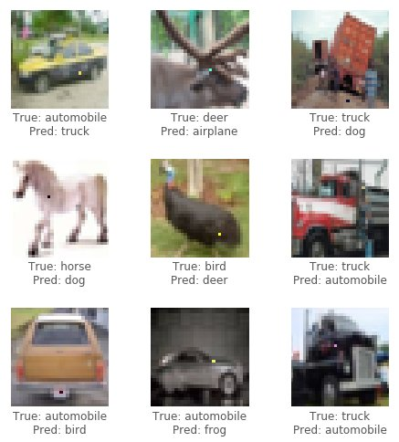
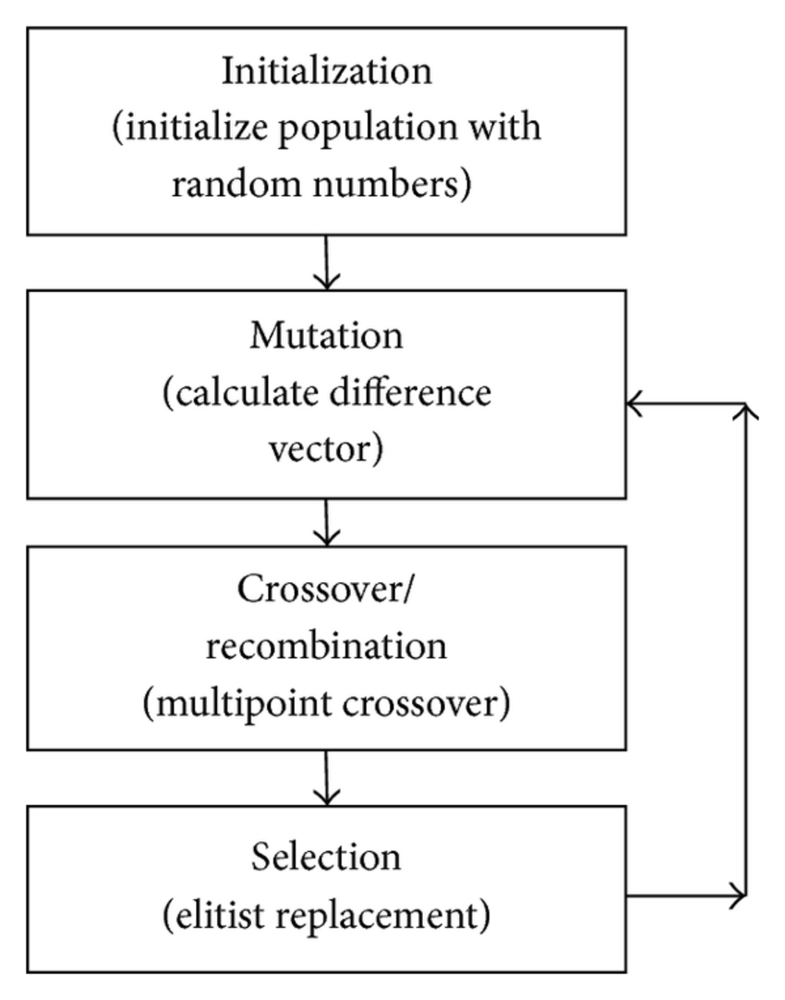
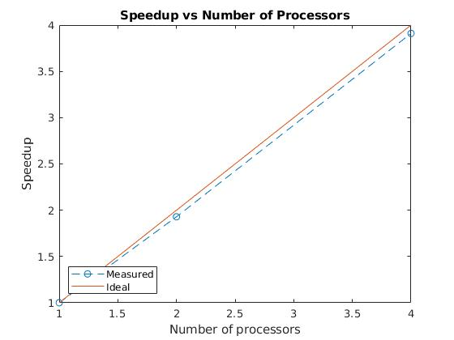
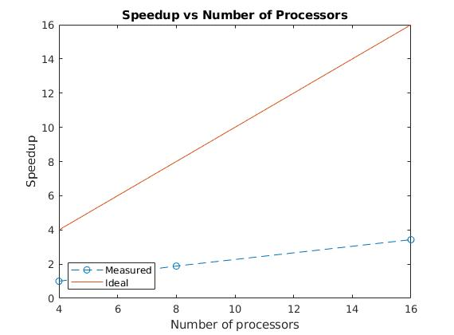

# Limited Pixel Attack BraTS
- An extremely limited scenario where the attacker can only perturb a certain number of pixels in the image.
- Semi-black box attack : requires only the probability labels.
- Differential Evolution is used to compute the locations and values of the pixels to be perturbed.

## Goal
- Determine the susuceptibility of our brain tumor classification model towards limited pixel attacks in order to prevent adversaries with malicious intent from taking advantage of it.
- Limited pixel attacks involve a state space search which is computationally very taxing for high dimensionsal images.
- Parallelize the existing limited pixel attack algorithm in order to reduce the long runtime and make it easier for researchers to test against this attack when developing a model.

## Objectives
- Train a brain tumor classification model using convolutional neural networks.
- Determine the effectiveness of limited pixel attacks on the trained model.
- In order to do this, parallelize the limited pixel attack to make the experiment less computationally taxing.

## Introduction
Neural networks have shown remarkable performance in computer vision tasks like image classification, segmentation and object detection. The use of neural networks in the field of healthcare has been increasing, with neural networks even beating human performance for tasks like chest X-ray analysis. However, the focus of these models is mostly on their performance aspect, and not their reliability. An attacker with malicious intentions can make use of the vulnerabilities of a machine learning model to cause serious harm to a patient's health. For instance, they could attack a model to misclassify one disease as another disease, or not detect a disease at all.

One such attack is the limited pixel attack. The limited pixel attack involves modifying the values of a certain number of pixels in the image, usually much less than the total number of pixels. The pixels to be attacked, as well as the final pixel values after the attack are chosen using the differential evolution algorithm. The differential evolution algorithm searches the entire space of attacks in an efficient manner, which can be parallelized.

An example of limited pixel attacks i.e. the one-pixel attack where only one pixel can be modified is shown below :

In this project, we create a neural network model to classify different types of brain tumors. The BraTS 2018 dataset is used, which has two types of brain tumors, High Grade Glioblastoma(HGG) and Low Grade Glioblastoma(LGG). We then check if our model is susceptible to limited pixel attacks. In order to speed things up, we parallelize the limited pixel attack.

## Model
The model trained is a convolutional neural network, with a structure similar to VGG-16 but with batch-norm layers. We find that our model has an accuracy of 74% when classifying HGG and LGG tumors.

## Differential Evolution

The perturbations to the image are encoded as an array that is optimized using differential evolution. Each candidate solution has a fixed number of perturbations, and each perturbation is a tuple holding four values : the x-y-z coordinates and the voxel value (voxels are the basic units of 3D images, analogous to pixels for 2D images). Each perturbation modifies one pixel.

Every iteration produces new candidates according to the equation  where x is the array of candidates, g is the iteration step and r1, r2 and r3 are not equal. The fitness of the generated candidates are compared to their parents. If the new candidate does better than its parent, then it replaces its parent.

In our case, fitness is the value of the probability label. For instance, if we are attacking an image with an HGG tumor, the probability of the image to be an HGG tumor as predicted by the neural network is the fitness value. So, the candidate with the lower probability would be retained by our algorithm, since our aim is to make the network predict the wrong value. If this probability goes below 50%, we say that the attack is succesful.

## Parallelizing Differential Evolution

We implement two ways to parallelize the code:

- Since attacks on different images are independent of each other, we assign different images to different processes. This brings down the total time by an amount close to the number of processes spawned.
- On speed profiling our code, we notice that the main bottleneck of the process is the evaluation of fitness of the candidates. We extend the first approach to include threads that independently evaluate the fitness of the candidates. So, we have n processes with m threads per process. Each image is assigned to one of the n processes, and the candidates created for an attack on that image are evaluated by the m threads that belong to the process.

## Results

The attack is unsuccesful for all 8 images in our test set (10 candidates and 10 iterations), implying that our model is safe and resistant towards limited pixel attacks.

Parallelizing the code using the first approach mentioned above gives the following runtimes : 
- 4 processes : 2225.41 s
- 2 processes : 4410.82 s
- 1 process : 8701.48s (same as serial execution)

Parallelizing the code using the second approach mentioned above gives the following runtimes : 
- 4 processes , 4 threads per process (16 processors in total) : 615.95 s
- 4 processes , 2 threads per process (8 processors in total) : 1119.87 s
- 4 processes - 1 thread per process (4 processors in total): 2112.37 s

## Conclusions

- Preliminary tests show that our model is safe towards limited pixel attacks.
- By parallelizing the code, we reduce the processing time from 8701 s to 616 s, i.e. to nearly 1/16th of its original value.

## Future Work

- Increasing the number of candidates and number of iterations will make the testing more rigorous and ensure reduce any further uncertainity about the safety of the model.

## References
- Jiawei Su, Danilo Vasconcellos Vargas, Sakurai Kouichi. "One pixel attack for fooling deep neural networks"
- B. H. Menze, A. Jakab, S. Bauer, J. Kalpathy-Cramer, K. Farahani, J. Kirby, et al. "The Multimodal Brain Tumor Image Segmentation Benchmark (BRATS)", IEEE Transactions on Medical Imaging 34(10), 1993-2024 (2015) DOI: 10.1109/TMI.2014.2377694
- S. Bakas, H. Akbari, A. Sotiras, M. Bilello, M. Rozycki, J.S. Kirby, et al., "Advancing The Cancer Genome Atlas glioma MRI collections with expert segmentation labels and radiomic features", Nature Scientific Data, 4:170117 (2017) DOI: 10.1038/sdata.2017.117
- S. Bakas, M. Reyes, A. Jakab, S. Bauer, M. Rempfler, A. Crimi, et al., "Identifying the Best Machine Learning Algorithms for Brain Tumor Segmentation, Progression Assessment, and Overall Survival Prediction in the BRATS Challenge", arXiv preprint arXiv:1811.02629 (2018)

